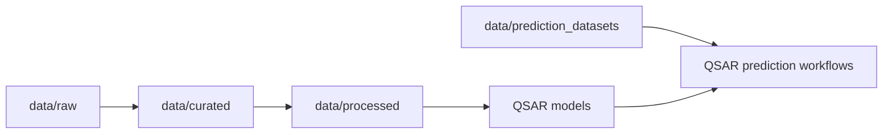

# Data

This directory contains all datasets used throughout the QSAR modeling workflow for antioxidant activity prediction. The datasets are organized according to their stage in the data processing pipeline, from raw data acquisition to modeling-ready datasets.

---

## Directory Structure

```
data/
├── raw/                     # Original datasets from external databases
├── curated/                 # Cleaned and normalized datasets
├── processed/               # Final modeling-ready datasets
└── prediction_datasets/     # External datasets for prediction and validation
```

| Directory | Description |
|---|---|
| `raw/` | Original datasets obtained from external databases before strict curation |
| `curated/` | Cleaned and normalized datasets with harmonized units, endpoint filtering, and statistical diagnostics |
| `processed/` | Final modeling datasets derived from curated data and used directly by QSAR models |
| `prediction_datasets/` | External molecular datasets used for QSAR prediction, phytochemical screening, and external validation analyses |

---

## Data Pipeline Overview

```
data_acquisition → data/raw → data/curated → data/processed → models
```

| Stage | Description |
|---|---|
| `data_acquisition` | Scripts used to retrieve bioactivity data from external databases |
| `data/raw` | Heterogeneous activity datasets prior to strict normalization and endpoint filtering, including external datasets used for prediction workflows |
| `data/curated` | Progressively cleaned datasets where activity values are normalized and endpoints are harmonized |
| `data/processed` | Modeling-ready datasets used for QSAR model training and evaluation |

---

## Dataset Lineage Summary

```
raw datasets
      ↓
curated datasets
      ↓
antioxidant12.csv
(IC50 processed dataset with potency category)
      │
      ├── filter Category = Bajo → antioxidant13.csv (High activity)
      │       └── split terciles → antioxidant14.csv
      │
      ├── filter Category = Medio → antioxidant15.csv (Medium activity)
      │
      └── independent low-activity branch → antioxidant18.csv (Low activity)

Reference and validation workflow:
antioxidant19.csv (ChEMBL reference dataset)
├── ensayo331.py  — ChEBI annotation
├── ensayo332.py  — ChEBI ontology summary analysis
├── ensayo348.py  — Prediction vs experimental validation
└── ensayo349.py  — External validation and comparative analysis
```

Processed datasets are then used by the modeling scripts located in the `models/` directory. External datasets stored in `data/prediction_datasets/` are used for downstream QSAR prediction and validation workflows.

---

## Reference Dataset: `antioxidant19.csv`

This dataset contains antioxidant compounds collected from ChEMBL and serves as the reference dataset for antioxidant activity analysis, chemical annotation, and external validation workflows within the QSAR project.

It combines chemical, experimental, and bibliographic information — including reported activity values for endpoints such as IC50 and EC50 — together with normalized and log-transformed activity variables.

**Roles within the project:**
- Antioxidant reference compound identification
- External QSAR validation workflows
- ChEBI annotation analyses
- Comparison against Cannabaceae-derived compounds

**Key columns**

| Column | Description |
|---|---|
| `Molecule ChEMBL ID` | ChEMBL identifier |
| `Molecule Name` | Compound name |
| `Smiles` | Molecular structure |
| `Standard Type` | Assay endpoint type (e.g., IC50, EC50) |
| `Standard Value` | Reported activity value |
| `Standard Units` | Units of measurement |
| `pChEMBL Value` | Normalized pChEMBL activity |
| `Assay Description` | Description of the assay |
| `Normalized Value (nM)` | Standardized activity value |
| `Log10 Value (nM)` | Log-transformed activity |
| `Potencia` | Qualitative potency classification |

> **Note:** `Normalized Value (nM)` and `Log10 Value (nM)` are standardized variables used for comparative analyses and external validation. `Potencia` is the final qualitative potency classification generated during internal processing. Some columns may contain missing values depending on original ChEMBL data availability.

---


